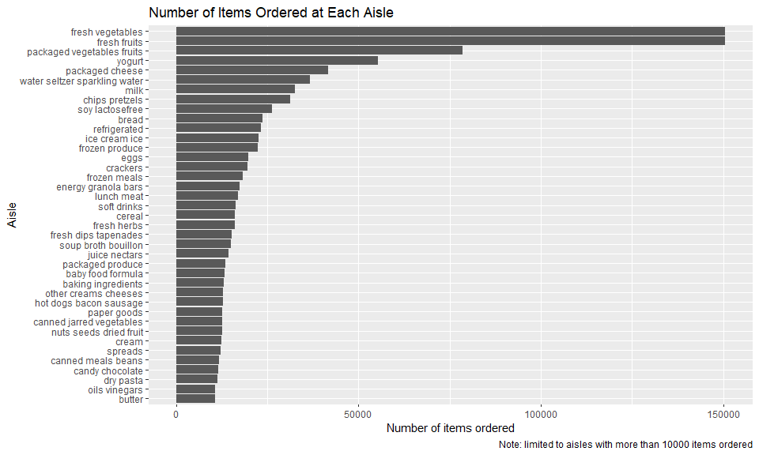

p8105_hw3_zz3167
================
Zhiyi Zhu
2023-10-08

``` r
library(tidyverse)
```

    ## ── Attaching core tidyverse packages ──────────────────────── tidyverse 2.0.0 ──
    ## ✔ dplyr     1.1.3     ✔ readr     2.1.4
    ## ✔ forcats   1.0.0     ✔ stringr   1.5.0
    ## ✔ ggplot2   3.4.3     ✔ tibble    3.2.1
    ## ✔ lubridate 1.9.2     ✔ tidyr     1.3.0
    ## ✔ purrr     1.0.2     
    ## ── Conflicts ────────────────────────────────────────── tidyverse_conflicts() ──
    ## ✖ dplyr::filter() masks stats::filter()
    ## ✖ dplyr::lag()    masks stats::lag()
    ## ℹ Use the conflicted package (<http://conflicted.r-lib.org/>) to force all conflicts to become errors

``` r
library(dplyr)
```

``` r
knitr::opts_chunk$set(
  fig.width = 6,
  fig.asp = .6,
  out.width = "90%",
  message = FALSE, 
  warning = FALSE
)
```

## Problem 1

``` r
library(p8105.datasets)
data("instacart")
```

### Write a short description of the dataset

- The dataset contains 1384617 observations of 131209 unique users with
  15 variables, which form a total of 20769255 data points.
- The key variables of the dataset contain order_id, product_id,
  add_to_cart_order, reordered, user_id, eval_set, order_number,
  order_dow, order_hour_of_day, days_since_prior_order, product_name,
  aisle_id, department_id, aisle, department.
- <mark>Describe some key variables:

``` r
skimr::skim(instacart)
```

|                                                  |           |
|:-------------------------------------------------|:----------|
| Name                                             | instacart |
| Number of rows                                   | 1384617   |
| Number of columns                                | 15        |
| \_\_\_\_\_\_\_\_\_\_\_\_\_\_\_\_\_\_\_\_\_\_\_   |           |
| Column type frequency:                           |           |
| character                                        | 4         |
| numeric                                          | 11        |
| \_\_\_\_\_\_\_\_\_\_\_\_\_\_\_\_\_\_\_\_\_\_\_\_ |           |
| Group variables                                  | None      |

Data summary

**Variable type: character**

| skim_variable | n_missing | complete_rate | min | max | empty | n_unique | whitespace |
|:--------------|----------:|--------------:|----:|----:|------:|---------:|-----------:|
| eval_set      |         0 |             1 |   5 |   5 |     0 |        1 |          0 |
| product_name  |         0 |             1 |   3 | 159 |     0 |    39123 |          0 |
| aisle         |         0 |             1 |   3 |  29 |     0 |      134 |          0 |
| department    |         0 |             1 |   4 |  15 |     0 |       21 |          0 |

**Variable type: numeric**

| skim_variable          | n_missing | complete_rate |       mean |        sd |  p0 |    p25 |     p50 |     p75 |    p100 | hist  |
|:-----------------------|----------:|--------------:|-----------:|----------:|----:|-------:|--------:|--------:|--------:|:------|
| order_id               |         0 |             1 | 1706297.62 | 989732.65 |   1 | 843370 | 1701880 | 2568023 | 3421070 | ▇▇▇▇▇ |
| product_id             |         0 |             1 |   25556.24 |  14121.27 |   1 |  13380 |   25298 |   37940 |   49688 | ▆▆▇▆▇ |
| add_to_cart_order      |         0 |             1 |       8.76 |      7.42 |   1 |      3 |       7 |      12 |      80 | ▇▁▁▁▁ |
| reordered              |         0 |             1 |       0.60 |      0.49 |   0 |      0 |       1 |       1 |       1 | ▆▁▁▁▇ |
| user_id                |         0 |             1 |  103112.78 |  59487.15 |   1 |  51732 |  102933 |  154959 |  206209 | ▇▇▇▇▇ |
| order_number           |         0 |             1 |      17.09 |     16.61 |   4 |      6 |      11 |      21 |     100 | ▇▂▁▁▁ |
| order_dow              |         0 |             1 |       2.70 |      2.17 |   0 |      1 |       3 |       5 |       6 | ▇▂▂▂▆ |
| order_hour_of_day      |         0 |             1 |      13.58 |      4.24 |   0 |     10 |      14 |      17 |      23 | ▁▃▇▇▃ |
| days_since_prior_order |         0 |             1 |      17.07 |     10.43 |   0 |      7 |      15 |      30 |      30 | ▅▅▃▂▇ |
| aisle_id               |         0 |             1 |      71.30 |     38.10 |   1 |     31 |      83 |     107 |     134 | ▆▃▃▇▆ |
| department_id          |         0 |             1 |       9.84 |      6.29 |   1 |      4 |       8 |      16 |      21 | ▇▂▂▅▂ |

- <mark>Give illstrative examples of observations:

``` r
knitr::kable(head(instacart))
```

| order_id | product_id | add_to_cart_order | reordered | user_id | eval_set | order_number | order_dow | order_hour_of_day | days_since_prior_order | product_name                                  | aisle_id | department_id | aisle                | department   |
|---------:|-----------:|------------------:|----------:|--------:|:---------|-------------:|----------:|------------------:|-----------------------:|:----------------------------------------------|---------:|--------------:|:---------------------|:-------------|
|        1 |      49302 |                 1 |         1 |  112108 | train    |            4 |         4 |                10 |                      9 | Bulgarian Yogurt                              |      120 |            16 | yogurt               | dairy eggs   |
|        1 |      11109 |                 2 |         1 |  112108 | train    |            4 |         4 |                10 |                      9 | Organic 4% Milk Fat Whole Milk Cottage Cheese |      108 |            16 | other creams cheeses | dairy eggs   |
|        1 |      10246 |                 3 |         0 |  112108 | train    |            4 |         4 |                10 |                      9 | Organic Celery Hearts                         |       83 |             4 | fresh vegetables     | produce      |
|        1 |      49683 |                 4 |         0 |  112108 | train    |            4 |         4 |                10 |                      9 | Cucumber Kirby                                |       83 |             4 | fresh vegetables     | produce      |
|        1 |      43633 |                 5 |         1 |  112108 | train    |            4 |         4 |                10 |                      9 | Lightly Smoked Sardines in Olive Oil          |       95 |            15 | canned meat seafood  | canned goods |
|        1 |      13176 |                 6 |         0 |  112108 | train    |            4 |         4 |                10 |                      9 | Bag of Organic Bananas                        |       24 |             4 | fresh fruits         | produce      |

### How many aisles are there, and which aisles are the most items ordered from?

``` r
aisles_num = 
  select(instacart,aisle_id) |>
  unique() |>
  nrow()

aisles_desc_order_df = 
  instacart |>
  group_by(aisle) |>
  summarize(n_obs = n()) |>
  arrange(desc(n_obs)) 
  
aisles_max =
  aisles_desc_order_df |>
  head(1) |>
  pull(aisle)
```

There’s total 134 aisles, among which fresh vegetables are the most
items ordered from.

### Make a plot that shows the number of items ordered in each aisle, limiting this to aisles with more than 10000 items ordered. Arrange aisles sensibly, and organize your plot so others can read it.

``` r
aisles_desc_order_df |>
  janitor::clean_names() |>
  filter(n_obs > 10000) |>
  ggplot(aes(x = reorder(aisle, n_obs), y = n_obs)) +
  geom_col() +
  coord_flip() +
  labs(
    title = "Number of Items Ordered at Each Aisle",
    x = "Aisle",
    y = "Number of items ordered",
    caption = "Note: limited to aisles with more than 10000 items ordered"
  )
```



### Make a table showing the three most popular items in each of the aisles “baking ingredients”, “dog food care”, and “packaged vegetables fruits”. Include the number of times each item is ordered in your table.

``` r
instacart |>
  janitor::clean_names() |>
  filter(aisle %in% c("baking ingredients", "dog food care", "packaged vegetables fruits")) |>
  group_by(aisle, product_name) |>
  summarise(n_products = n()) |>
  arrange(desc(n_products)) |>
  ungroup() |> 
  group_by(aisle) |>
  slice_head(n = 3)|>
  knitr::kable(caption = "Top 3 Most Popular Items in Selected Aisles", position = "top")
```

| aisle                      | product_name                                  | n_products |
|:---------------------------|:----------------------------------------------|-----------:|
| baking ingredients         | Light Brown Sugar                             |        499 |
| baking ingredients         | Pure Baking Soda                              |        387 |
| baking ingredients         | Cane Sugar                                    |        336 |
| dog food care              | Snack Sticks Chicken & Rice Recipe Dog Treats |         30 |
| dog food care              | Organix Chicken & Brown Rice Recipe           |         28 |
| dog food care              | Small Dog Biscuits                            |         26 |
| packaged vegetables fruits | Organic Baby Spinach                          |       9784 |
| packaged vegetables fruits | Organic Raspberries                           |       5546 |
| packaged vegetables fruits | Organic Blueberries                           |       4966 |

Top 3 Most Popular Items in Selected Aisles

### Make a table showing the mean hour of the day at which Pink Lady Apples and Coffee Ice Cream are ordered on each day of the week; format this table for human readers

``` r
instacart |>
  janitor::clean_names() |>
  filter(product_name %in% c("Pink Lady Apples", "Coffee Ice Cream")) |>
  group_by(order_dow, product_name) |>
  summarise(mean_hour_of_the_day = mean(order_hour_of_day)) |>
  mutate(
    order_dow = case_match(
      order_dow,
      0 ~ 'Sunday',
      1 ~ 'Monday',
      2 ~ 'Tuesday',
      3 ~ 'Wednesday',
      4 ~ 'Thursday',
      5 ~ 'Friday',
      6 ~ 'Saturday'
    )) |>
  pivot_wider(names_from = order_dow, values_from = mean_hour_of_the_day) |>
  knitr::kable(caption = "Mean Hour of the Day for Pink Lady Apples and Coffee Ice Cream in One Week", position = "top")
```

| product_name     |   Sunday |   Monday |  Tuesday | Wednesday | Thursday |   Friday | Saturday |
|:-----------------|---------:|---------:|---------:|----------:|---------:|---------:|---------:|
| Coffee Ice Cream | 13.77419 | 14.31579 | 15.38095 |  15.31818 | 15.21739 | 12.26316 | 13.83333 |
| Pink Lady Apples | 13.44118 | 11.36000 | 11.70213 |  14.25000 | 11.55172 | 12.78431 | 11.93750 |

Mean Hour of the Day for Pink Lady Apples and Coffee Ice Cream in One
Week
