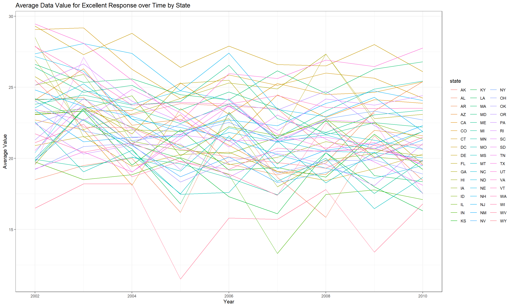
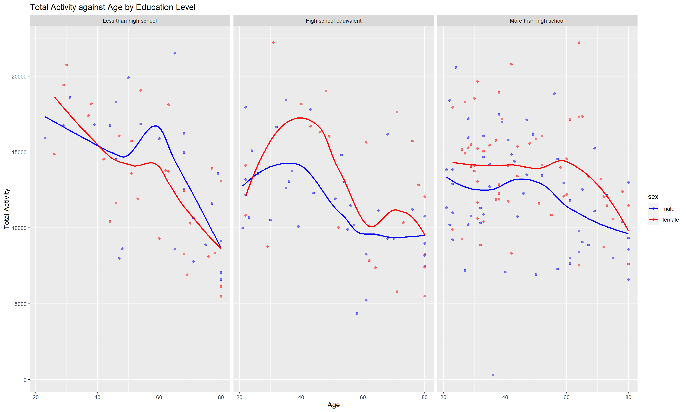

p8105_hw3_zz3167
================
Zhiyi Zhu
2023-10-08

``` r
library(tidyverse)
```

    ## ── Attaching core tidyverse packages ──────────────────────── tidyverse 2.0.0 ──
    ## ✔ dplyr     1.1.3     ✔ readr     2.1.4
    ## ✔ forcats   1.0.0     ✔ stringr   1.5.0
    ## ✔ ggplot2   3.4.3     ✔ tibble    3.2.1
    ## ✔ lubridate 1.9.2     ✔ tidyr     1.3.0
    ## ✔ purrr     1.0.2     
    ## ── Conflicts ────────────────────────────────────────── tidyverse_conflicts() ──
    ## ✖ dplyr::filter() masks stats::filter()
    ## ✖ dplyr::lag()    masks stats::lag()
    ## ℹ Use the conflicted package (<http://conflicted.r-lib.org/>) to force all conflicts to become errors

``` r
library(dplyr)
library(ggplot2)
```

``` r
knitr::opts_chunk$set(
  fig.width = 15,
  fig.asp = .6,
  dpi = 200,
  out.width = "90%",
  message = FALSE, 
  warning = FALSE
)
```

## Problem 1

### Load the data

``` r
library(p8105.datasets)
data("instacart")
```

### Write a short description of the dataset

- The dataset contains 1384617 observations of 131209 unique users with
  15 variables, which form a total of 20769255 data points.
- The dataset consists of information about products ordered through
  Instacart. Each row corresponds to a product and contains details such
  as the product’s ID (`product_id`), the order’s ID (`order_id`), the
  order in which the item was added to the cart (`add_to_cart_order`),
  whether the item has been ordered before (`reordered`), and the
  customer’s ID (`user_id`).
- Each product is described by its name (`product_name`), the aisle it
  belongs to (`aisle`), the aisle’s ID (`aisle_id`), and the department
  it falls under (`department`). For instance, the product’s name could
  be something like “Bulgarian Yogurt,” it belongs to the “yogurt” aisle
  with an aisle ID(120), and its department is “dairy eggs.” Similarly,
  another product might be a “Organic Celery Hearts” in the “fresh
  vegetables” aisle with aisle ID(83), belonging to the “produce”
  department.

### How many aisles are there, and which aisles are the most items ordered from?

``` r
aisles_num = 
  select(instacart,aisle_id) |>
  unique() |>
  nrow()

aisles_desc_order_df = 
  instacart |>
  group_by(aisle) |>
  summarize(n_obs = n()) |>
  arrange(desc(n_obs)) 
  
aisles_max =
  aisles_desc_order_df |>
  head(1) |>
  pull(aisle)
```

There’s total 134 aisles, among which fresh vegetables are the most
items ordered from.

### Make a plot that shows the number of items ordered in each aisle, limiting this to aisles with more than 10000 items ordered. Arrange aisles sensibly, and organize your plot so others can read it.

``` r
aisles_desc_order_df |>
  janitor::clean_names() |>
  filter(n_obs > 10000) |>
  ggplot(aes(x = reorder(aisle, n_obs), y = n_obs)) +
  geom_col() +
  coord_flip() +
  labs(
    title = "Number of Items Ordered at Each Aisle",
    x = "Aisle",
    y = "Number of items ordered",
    caption = "Note: limited to aisles with more than 10000 items ordered"
  )
```


#### Comment on the results:

- The plot indicates that the largest number of items ordered comes from
  the “fresh vegetables” and “fresh fruits” aisles.

### Make a table showing the three most popular items in each of the aisles “baking ingredients”, “dog food care”, and “packaged vegetables fruits”. Include the number of times each item is ordered in your table.

``` r
instacart |>
  janitor::clean_names() |>
  filter(aisle %in% c("baking ingredients", "dog food care", "packaged vegetables fruits")) |>
  group_by(aisle) |> 
  count(product_name) |> 
  mutate(rank = min_rank(desc(n))) |> 
  filter(rank < 4) |> 
  arrange(desc(n)) |>
  knitr::kable()
```

| aisle                      | product_name                                  |    n | rank |
|:---------------------------|:----------------------------------------------|-----:|-----:|
| packaged vegetables fruits | Organic Baby Spinach                          | 9784 |    1 |
| packaged vegetables fruits | Organic Raspberries                           | 5546 |    2 |
| packaged vegetables fruits | Organic Blueberries                           | 4966 |    3 |
| baking ingredients         | Light Brown Sugar                             |  499 |    1 |
| baking ingredients         | Pure Baking Soda                              |  387 |    2 |
| baking ingredients         | Cane Sugar                                    |  336 |    3 |
| dog food care              | Snack Sticks Chicken & Rice Recipe Dog Treats |   30 |    1 |
| dog food care              | Organix Chicken & Brown Rice Recipe           |   28 |    2 |
| dog food care              | Small Dog Biscuits                            |   26 |    3 |

#### Comment on the results:

- In the “Packaged Vegetables Fruits” aisle, “Organic Baby Spinach” is
  the most popular product with a count of 9784. “Organic Raspberries”
  and “Organic Blueberries” are the 2nd and 3rd most popular in the same
  aisle, with counts of 5546 and 4966 respectively.
- In the “Baking Ingredients” aisle, “Light Brown Sugar” is the top
  product with a count of 499. “Pure Baking Soda” and “Cane Sugar” are
  the 2nd and 3rd most popular baking ingredients, with counts of 387
  and 336 respectively.
- In the “Dog Food Care” aisle, “Snack Sticks Chicken & Rice Recipe Dog
  Treats” is the most popular with a count of 30. “Organix Chicken &
  Brown Rice Recipe” and “Small Dog Biscuits” are the 2nd and 3rd most
  popular dog food care products, with counts of 28 and 26 respectively.

### Make a table showing the mean hour of the day at which Pink Lady Apples and Coffee Ice Cream are ordered on each day of the week; format this table for human readers

``` r
instacart |>
  janitor::clean_names() |>
  filter(product_name %in% c("Pink Lady Apples", "Coffee Ice Cream")) |>
  group_by(order_dow, product_name) |>
  summarise(mean_hour_of_the_day = mean(order_hour_of_day)) |>
  mutate(
    order_dow = case_match(
      order_dow,
      0 ~ 'Sunday',
      1 ~ 'Monday',
      2 ~ 'Tuesday',
      3 ~ 'Wednesday',
      4 ~ 'Thursday',
      5 ~ 'Friday',
      6 ~ 'Saturday'
    )) |>
  pivot_wider(names_from = order_dow, values_from = mean_hour_of_the_day) |>
  knitr::kable(digits = 2)
```

| product_name     | Sunday | Monday | Tuesday | Wednesday | Thursday | Friday | Saturday |
|:-----------------|-------:|-------:|--------:|----------:|---------:|-------:|---------:|
| Coffee Ice Cream |  13.77 |  14.32 |   15.38 |     15.32 |    15.22 |  12.26 |    13.83 |
| Pink Lady Apples |  13.44 |  11.36 |   11.70 |     14.25 |    11.55 |  12.78 |    11.94 |

#### Comment on the results:

- In general, customers tend to order “Coffee Ice Cream” later in the
  day, especially on Tuesday, Wednesday, and Thursday. For ‘Pink Lady
  Apples’, the orders tend to be placed earlier in the day, Usually
  around noon.

## Problem 2

### Load the data

``` r
library(p8105.datasets)
data("brfss_smart2010")
```

### Do some data cleaning

``` r
brfss_new_df = 
  brfss_smart2010 |>
  janitor::clean_names() |>
  rename(state = locationabbr, location = locationdesc) |>
  filter(
    topic == "Overall Health",
    response %in% c("Excellent", "Very good", "Good", "Fair", "Poor")) |>
  mutate(response = factor(response, levels = c("Poor", "Fair", "Good", "Very good", "Excellent"), order = TRUE))
```

### Answer the following questions and comment on the results.

#### In 2002, which states were observed at 7 or more locations? What about in 2010?

``` r
states_2002 = 
  brfss_new_df |>
  filter(year == "2002") |>
  group_by(state) |>
  summarise(n_location = n_distinct(location)) |>
  filter(n_location >= 7) |>
  pull(state)

states_2010 = 
  brfss_new_df |>
  filter(year == "2010") |>
  group_by(state) |>
  summarise(n_location = n_distinct(location)) |>
  filter(n_location >= 7) |>
  pull(state)
```

#### Comment on the results:

In 2002, CT, FL, MA, NC, NJ, PA were observed at 7 or more locations.

In 2010, CA, CO, FL, MA, MD, NC, NE, NJ, NY, OH, PA, SC, TX, WA were
observed at 7 or more locations.

#### Construct a dataset that meets the criteria and make a plot.

``` r
brfss_excellent = 
  brfss_new_df |>
  filter(response == "Excellent") |>
  group_by(year, state) |>
  summarise(mean_data_value = mean(data_value, na.rm = TRUE))

brfss_excellent |>
  ggplot(aes(x = year, y = mean_data_value, group = state, color = state)) +
  geom_line() +
  labs(
    title ="Excellent Responses Variation Across Different States",
    x = "Year",
    y = "Average Value") +
  theme_bw()
```



#### Comment on the results:

- From the spaghetti plot we can see that the mean value varies between
  11.5 and 29.46. For some states, the fluctuation is considerable.

#### Make a two-panel plot

``` r
brfss_new_df |>
  filter(year %in% c(2006,2010),state == "NY") |>
  ggplot(aes(x = response, y = data_value)) +
  geom_boxplot() +
  facet_wrap(.~ year) +
  labs(title = "Distribution of Data Value by Response in NY State for 2006 and 2010",
       x = "Response",
       y = "Data Value")
```


#### Comment on the results:

- Comparing the two boxplots, we can find that they have similar
  distribution. In 2006 and 2010, “very good” response corresponded to
  the highest average data value, and “poor” response corresponded to
  the lowest average data value.

## Problem 3

### Load, tidy, merge and organize the data sets

``` r
nhanes_accel = 
  read_csv("data/nhanes_accel.csv") |>
  janitor::clean_names()

nhanes_covar =
  read_csv("data/nhanes_covar.csv", skip = 4) |>
  janitor::clean_names()

nhanes_df = 
  full_join(nhanes_covar, nhanes_accel, by = "seqn") |>
  filter(age >= 21) |>
  drop_na(sex, age, bmi, education) |>
  mutate(sex = case_match(sex, 1 ~ "male", 2 ~ "female"),
         sex = factor(sex, levels = c("male", "female"), ordered = TRUE),
         education = case_match(education,
                                1 ~ "Less than high school",
                                2 ~ "High school equivalent",
                                3 ~ "More than high school"),
         education = factor(education, levels = c("Less than high school", "High school equivalent", "More than high school"), ordered = TRUE))
```

### Produce a reader-friendly table

``` r
nhanes_df |>
  group_by(sex, education) |>
  summarise(n_obs = n()) |>
  pivot_wider(
    names_from = education,
    values_from = n_obs
  ) |>
  knitr::kable()
```

| sex    | Less than high school | High school equivalent | More than high school |
|:-------|----------------------:|-----------------------:|----------------------:|
| male   |                    27 |                     35 |                    56 |
| female |                    28 |                     23 |                    59 |

#### Comment on these items

From the table, we can find that the number of people with the
educational category of “More than high school” is the largest and the
number of people with the educational category of “Less than high
school” is the least. Across all education categories, men outnumbered
women at “High school equivalent” and “More than high school”
categories. At “Less than high school” category, women outnumber men
slightly.

### Create a visualization of the age distributions

``` r
nhanes_df |>
  ggplot(aes(x = education, y = age, fill = sex)) +
  geom_boxplot() +
  labs(title = "Age Distribution by Education and Gender",
       x = "Education",
       y = "Age") +
  scale_fill_manual(values = c("male" = "lightblue", "female" = "pink"))
```


#### Comment on these items

- The plot illustrates a noteworthy trend: individuals with an
  educational level of “more than high school” exhibit the lowest
  average age, while those with an education level of “less than high
  school” demonstrate a relatively higher average age. This observation
  suggests a positive trajectory in educational accessibility and
  attainment over the years, signifying an increasing abundance of
  educational resources and a growing number of individuals can receive
  higher education.

### Create a total activity variable for each participant

``` r
total_activity_df = 
  nhanes_df|>
  pivot_longer(
    cols = starts_with("min"),
               names_to = "time",
               values_to = "min_act")|>
  group_by(seqn)|>
  summarize(total_activity=sum(min_act)) 

combine_activity_df = 
  full_join(nhanes_df, total_activity_df, by ="seqn") |>
  select(-starts_with("min"))
```

### Plot these total activities (y-axis) against age (x-axis)

``` r
combine_activity_df |>
  ggplot(aes(x = age, y = total_activity, color = sex)) +
  geom_point(alpha = .5) +
  geom_smooth(se = FALSE) +
  facet_grid(.~education) +
  labs(title = "Total Activity against by Age, Sex, and Education Level",
       x = "Age",
       y = "Total Activity") +
  scale_color_manual(values = c("male" = "blue", "female" = "red")) 
```



#### Comment on these items

- In the group with an education level of “less than high school”,
  individuals around the age of 20 tend to have higher total activities.
  For those with an education level of “high school equivalent”,
  individuals around the age of 40 exhibit the highest total activities.
  Conversely, in the group with an education level of “more than high
  school”, individuals around the age of 60 demonstrate the highest
  total activities. Across both the “less than high school” and “more
  than high school” education levels, females generally have more total
  activities compared to males.

### Make a three-panel plot that shows the 24-hour activity time courses

``` r
nhanes_df |>
  pivot_longer(
    cols = starts_with("min"),
    names_to = "time",
    values_to = "min_act"
  ) |>
  mutate(time = str_remove(time, "min")) |>
  mutate(time = as.numeric(time))|>
  ggplot(aes(x = time, y = min_act, color = sex)) +
  geom_point(alpha = .2) +
  geom_smooth(se = FALSE) +
  facet_grid(. ~ education) +
  scale_x_continuous(
    limits = c(0, 1440),  
    breaks = seq(0, 1440, 120)
  ) +
  labs(
    title = "24-Hour Activity Time Courses",
    x = "time",
    y = "activity",
    caption = "Data from nhanes dataset"
  ) +
  scale_color_manual(values = c("male" = "green", "female" = "blue"))
```


#### Comment on these items

- From the graph, we notice that each education level exhibits a similar
  trend in daily activity. In comparison to the evening, people tend to
  be more active during the day. In general, across all three education
  levels, women, on average, demonstrated higher activity levels than
  men.
